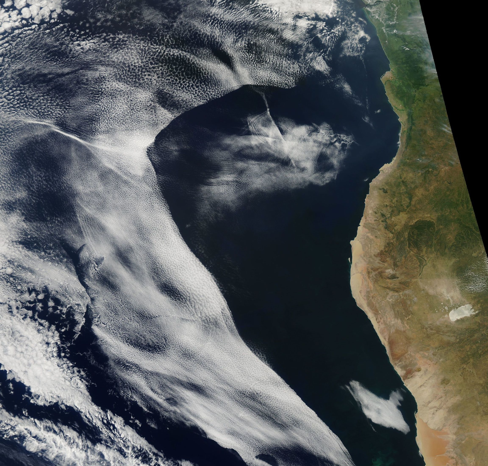
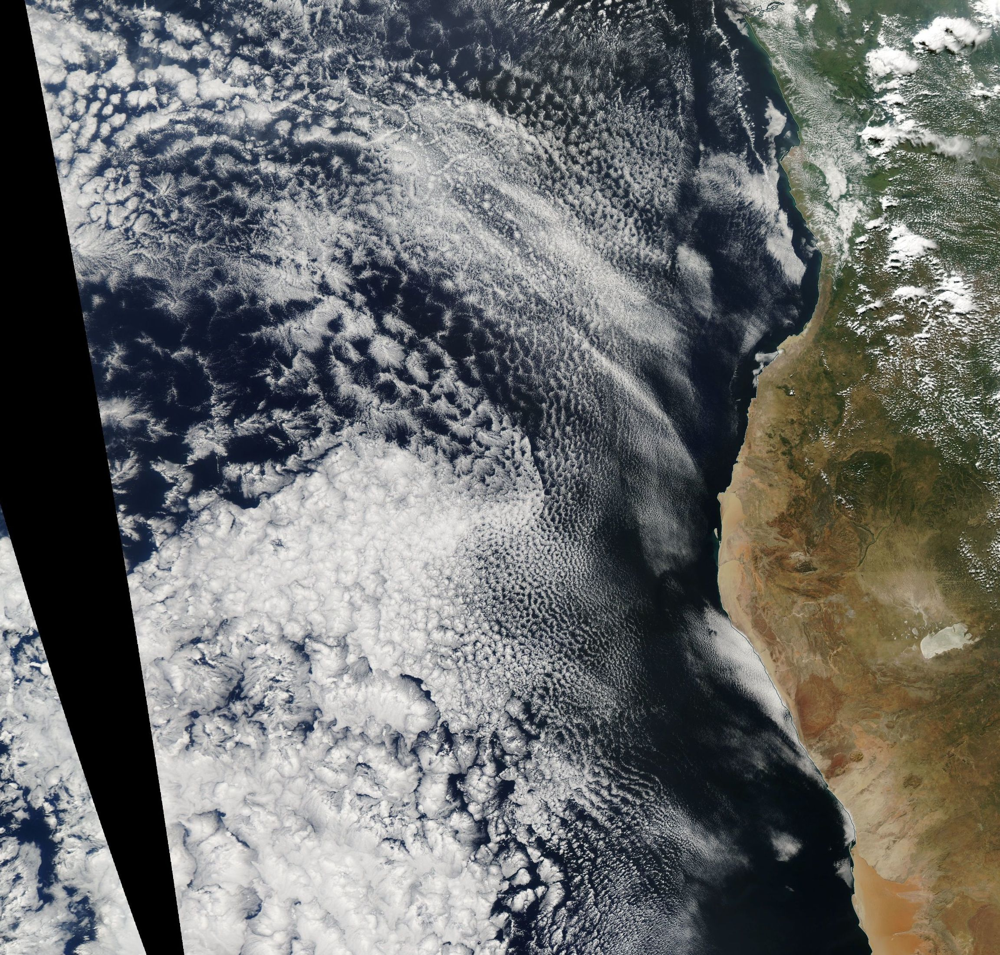

```{r setup, include=FALSE}
library(knitr)
opts_chunk$set(echo = TRUE)
opts_chunk$set('python', engine.path='C:\\Users\\Laura\\Anaconda3\\envs\\python2')
```

```{python}
import numpy as np
#x = 42
#print(x)
#print("Hello World")
x = np.arange(0,35,1)

execfile('test.py')
```

## Introduction

Shallow boundary layer clouds cover vast amounts of subtropical oceans and have an overall cooling effect on the climate (@hartmann1992effect) and are thus important topics of research. In this project shallow boundary layer clouds and stratocumulus clouds will be used interchangeably. These clouds have favored development in particular on the eastern side of subtropical oceans. These clouds are also described as "semipermanent" (@wood2012stratocumulus) because they exist for large periods of time. 

The stratocumulus cloud sheet over the Southeast Atlantic Ocean experiences what have been called "cloud clearing events" which feature large, sharp propogating boundaries which cause irreversible clearing of the low cloud (see \label{clearing}). These events are important to understand the effect they have on the Earth's energy balance and the dynamics and feedbacks of the cloud in general. They have been largely unstudied to date. My master's thesis project will focus on simulating these events with the Weather Research and Forecasting (WRF) Model. For this class project a simple case study will be conducted to look at the environmental conditions associated with a clearing event (\label{clearing}). These conditions will be compared to another case without a cloud clearing event (\label{noclearing}). 

```{r clearing, echo=FALSE,fig.cap="."}

```

```{r noclearing, echo=FALSE,fig.cap="."}

```